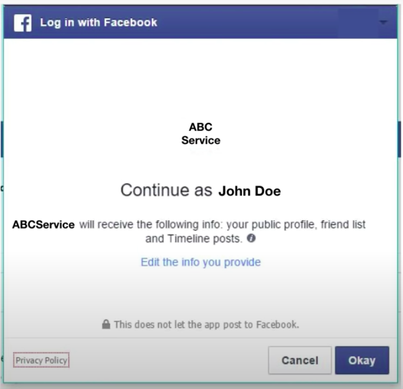
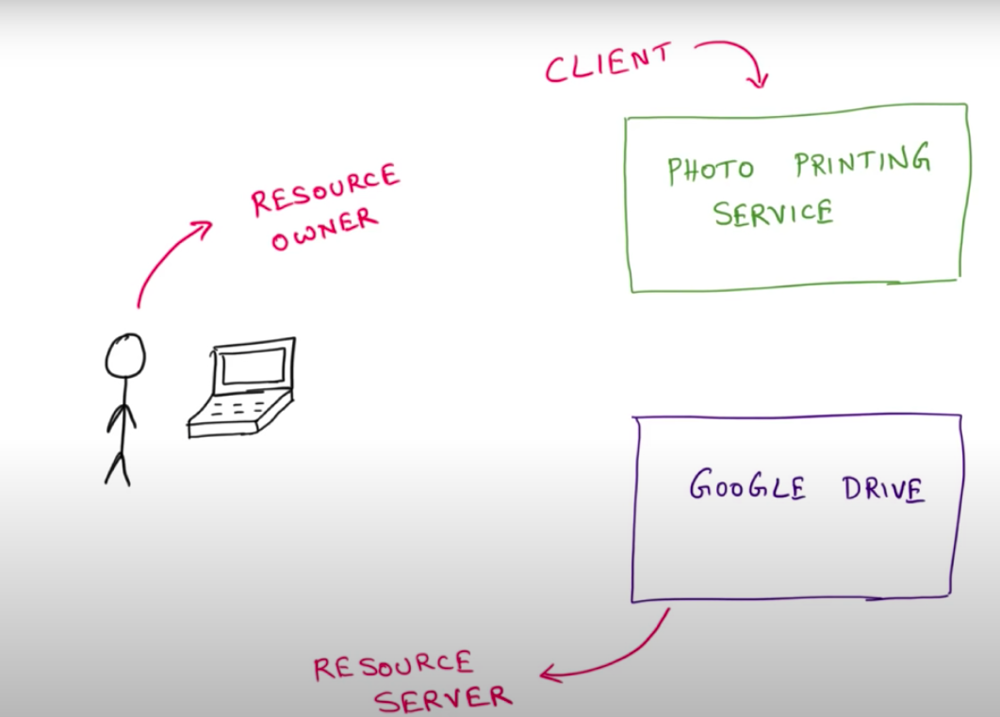
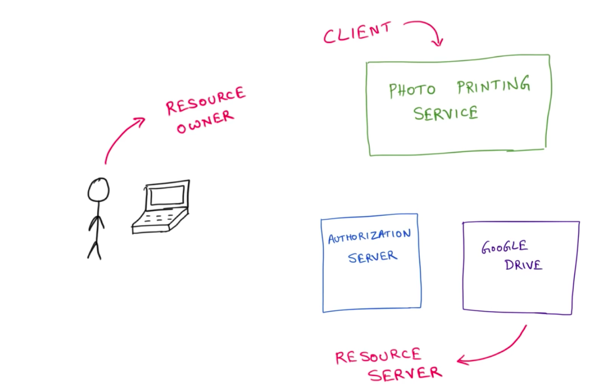

<h2 align="center">OAUTH 2.0</h2>

The auth in OAUTH stands for authorization and not authentication.

Used for authorization between services.

<li> For ex. A photo printing service where the user upload their photos and the service prints the photo for them but now a days mostly users store photo on cloud therefore it would be a good option to for the user to directly upload the photo from their google drive</li>
<li> To support this OAUTH comes into existence if both the application have OAUTH implemented the photo printing service will go google and ask for the files then google will instead forward the request to the user and ask the user to verify whether the service is legit or not(i.e asks for permissions).  </li>
<li>Once the user verifies that the service is legit the google in turns shares the requested data and gives a JWT token (LIMITED ACCESS) for further communication </li>
<li>Example of a OAuth Screen presented to the user</li>

NOTE - In both the service i.e the Photo Printing Service and Google drive the user is already authenticated and for direct communication between these 2 services OAUTH is used, Which makes it pretty clear that in this case OAUTH is user only for Authorization and is most of the cases OAUTH is used for AUTHORIZATION.

<h4 align="center">OAUTH Terminologies</h4>
<li>RESOURCE (Protected Resources) - The Thing that needs to be accessed i.e photos on google drive in context of the above example. </li>
<li>RESOURCE OWNER - The Person that has the access to the Resource and is capable of granting access to that protected Resource</li>
<li>RESOURCE SERVER - The Server Hosting the Resource or where the Resource lies</li>
<li>CLIENT - An Application making protected resource requests on behalf of the resource owner and with is authorization i.e the Photo printing service is the client in the above context</li>
<li> AUTHORIZATION SERVER - To authorize the users accessing the resource server and providing them the token.</li>

<li>Who has the burden of security in the entire context? </li>
<li> -> The person who has the resource i.e in the above context it is google drive's responsibility to manage security and the resource doesn't land into the wrong hands</li>
<li> -> Therefore Resource Server has to implement an authorization server (OAUTH 2.0) to manage the security.</li>

<h2 align="center">Flows of OAUTH 2.0</h2>

<h3>1. Authorization Code Flow(Best and the most trusted)</h3>

When an CLIENT approaches RESOURCE SERVER (AUTHORIZATION SERVER + RESOURCE SERVER)  asking for the stored RESOURCE then AUTHORIZATION SERVER asks the RESOURCES OWNER whether the CLIENT is legit or not if the CLIENT is legit then the AUTHORIZATION SERVER sends the CLIENT an Authorization Token(Short lived) then the CLIENT uses this Authorization Token and asks for Access token to the AUTHORIZATION SERVER and then CLIENT can access the necessary RESOURCES using the access token.

The access token is exchanged securely as Authorization Token is required for it which is also short lived.

 
<h3>2. Implicit Flow</h3>

When an CLIENT approaches RESOURCE SERVER (AUTHORIZATION SERVER + RESOURCE SERVER)  asking for the stored RESOURCE then AUTHORIZATION SERVER asks the RESOURCES OWNER whether the CLIENT is legit or not if the CLIENT is legit then the AUTHORIZATION SERVER sends directly the Access token  to the CLIENT instead of Authorization Token and then the CLIENT can access the necessary RESOURCES using the access token.

DrawBack - With the access token anybody can access the Resource as there is no secure way of exchanging the access token. - NOT VERY SECURE

Primarily used in javascript app running on a browser and are short lived.

 
<h3>3. Client Credentials Flow(When the client is well trusted)</h3>

Used for authorization between microservices which are not controller by any username or password explicitly.

With machine-to-machine (M2M) applications, such as CLIs, or services running on your back-end, the system authenticates and authorizes the app rather than a user. For this scenario, typical authentication schemes like username + password or social logins don't make sense. Instead, M2M apps use the Client Credentials Flow  in which they pass along their Client ID and Client Secret to authenticate themselves and get a token

