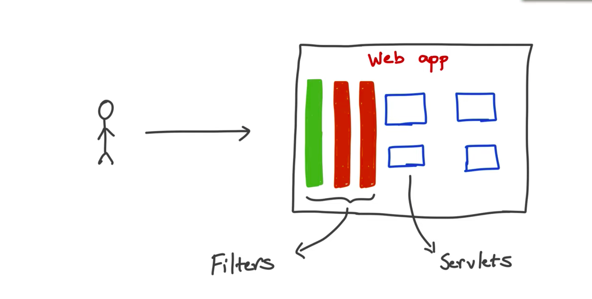
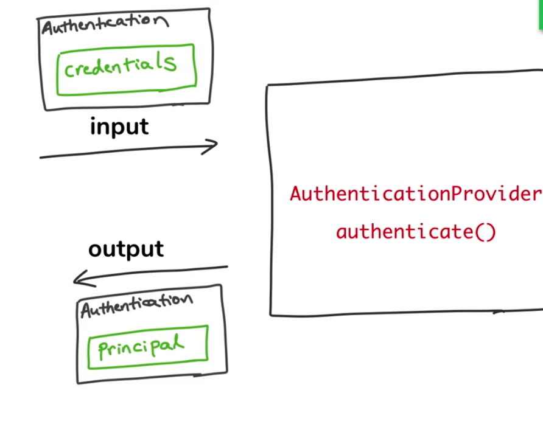

<h2 align ="center"> 5 Core Concepts of Spring Security</h2>

<h3 align="center"><strong><li>AUTHENTICATION</strong> - Who Are You ?</l1></h3>

<strong>Knowledge Based Authentication</strong> - Authentication depending on username and password which is a type of knowledge you have 

<strong>Possesive Authentication</strong> - OTP, Text Messages on your phone 

<strong>Multi Factor or 2 Factor Authentication</strong> - Knowledge Based + Possesive Authentication 

 
<h3 align="center"><strong><li>AUTHORIZATION</strong> - I know who you are but are you allowed to do that ?</h3></li>
 
<h3 align="center"><strong><li>PRINCIPAL</strong> - The Currently Logged in user or the user with the particular account</li></h3>
 
<h3 align="center"><strong><li>AUTHORITIES/PERMISSIONS/GRANTED AUTHORITY</strong></l1> </h3>

Permissions allowed for a specific users and then the user is authorized to do that action

Ex In a retail store A Clerk can do_checkout, make_store_announcements but a Manager can do_checkout, make_store_announcements and view_financial_record 

Fine Granual Control

 
<li><h3 align="center"><strong>ROLES</strong></h3></li>

Roles are a group of authorities/permissions that are assigned toghether i.e ROLE_MANAGER will have do_checkout, make_store_announcements and view_financial_record and ROLE_CLERK will have do_checkout, make_store_announcements

It makes easier to group permission and assign them to the user to be consistent 

Coarse Grained

<h2 align="center"><strong>How Spring Authentication Works?</h3>

Spring Security is basically an filter which block each request coming into the application and then process on it

Spring Security is applied on the entire application and not on a particular part/URL

In Spring Security when the authentication is successfull the authentication return Information about the logged in user

It Keeps Track of the both input(User credentials) and output(verified or not) using the object of Type AUTHENTICATION it is an internal spring security interface  

The Authentication objects the credentials before authentication and then the PRINCIPAL(Verified User Information) after authentication

Authentication Provider Is Responsible for doing the actual Authentication it is an interface having the method authenticate.

We need to have implementation of this interface in our application and inform Spring Security
