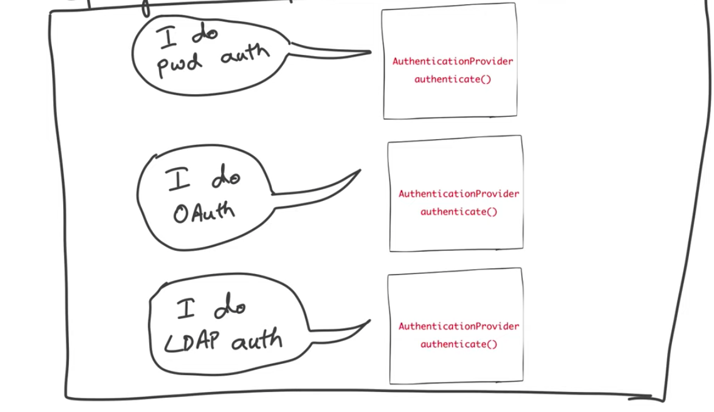
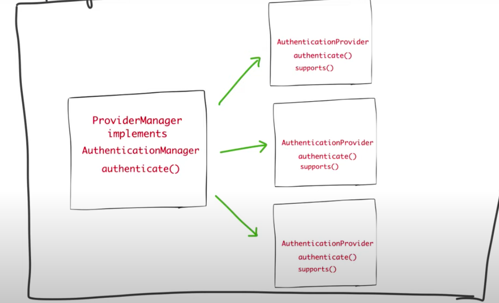
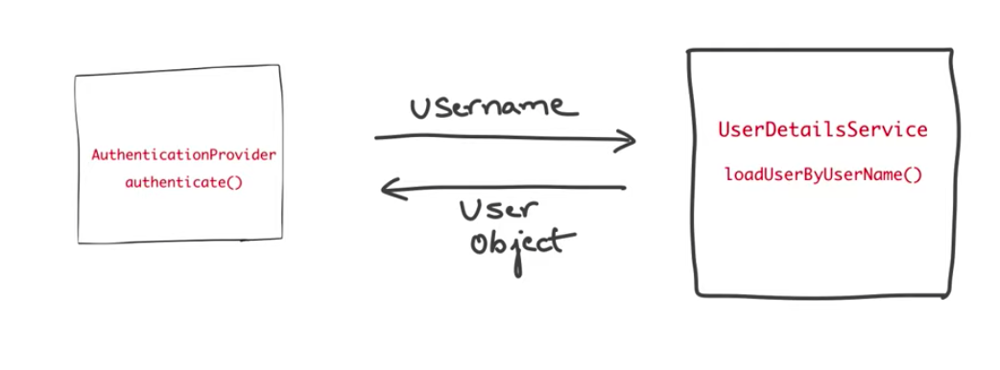
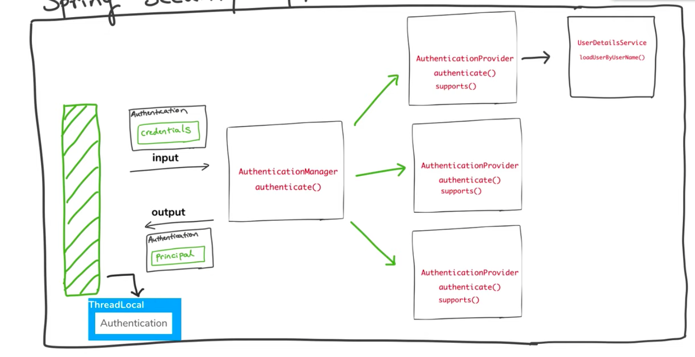
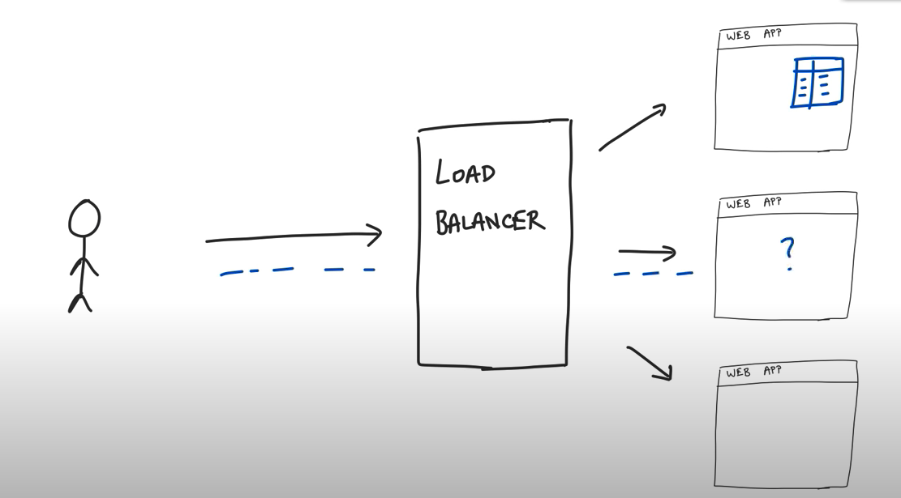

<h2 align ="center">Spring Security</h2>

<h2 align ="center"> 5 Core Concepts of Spring Security</h2>

<h3 align="center"><strong><li>AUTHENTICATION</strong> - Who Are You ?</l1></h3>

<strong>Knowledge Based Authentication</strong> - Authentication depending on username and password which is a type of knowledge you have 

<strong>Possesive Authentication</strong> - OTP, Text Messages on your phone 

<strong>Multi Factor or 2 Factor Authentication</strong> - Knowledge Based + Possesive Authentication 

 
<h3 align="center"><strong><li>AUTHORIZATION</strong> - I know who you are but are you allowed to do that ?</h3></li>
 
<h3 align="center"><strong><li>PRINCIPAL</strong> - The Currently Logged in user or the user with the particular account</li></h3>
 
<h3 align="center"><strong><li>AUTHORITIES/PERMISSIONS/GRANTED AUTHORITY</strong></l1> </h3>

Permissions allowed for a specific users and then the user is authorized to do that action

Ex In a retail store A Clerk can do_checkout, make_store_announcements but a Manager can do_checkout, make_store_announcements and view_financial_record 

Fine Granual Control

 
<li><h3 align="center"><strong>ROLES</strong></h3></li>

Roles are a group of authorities/permissions that are assigned toghether i.e ROLE_MANAGER will have do_checkout, make_store_announcements and view_financial_record and ROLE_CLERK will have do_checkout, make_store_announcements

It makes easier to group permission and assign them to the user to be consistent 

Coarse Grained

<h2 align="center"><strong>How Spring Authentication Works?</strong></h2>

Spring Security is basically an filter which block each request coming into the application and then process on it

Spring Security is applied on the entire application and not on a particular part/URL

In Spring Security when the authentication is successfull the authentication return Information about the logged in user

It Keeps Track of the both input(User credentials) and output(verified or not) using the object of Type AUTHENTICATION it is an internal spring security interface  

The Authentication objects the credentials before authentication and then the PRINCIPAL(Verified User Information) after authentication

Authentication Provider Is Responsible for doing the actual Authentication it is an interface having the method authenticate.

We need to have implementation of this interface in our application and inform Spring Security

User Enters his username and password, Spring Security puts this into the AUTHENTICATION object it goes to the implementation of the Authentication Provider and calls the authenticate method. If the credentials are right it then return the information about the currently logged in user in the Same AUTHENTICATION object

Each Application have more than 1 way to authenticate users. For ex UserName and Password based, OAuth based or LDAP based. 

Therefore there can multiple Authentication Provider in an application.

To Coordinate Between all of these Authentication Provider there is a PROVIDERMANAGER

The ProviderManager asks all the AuthenticationProvider for the authentication type they support. To Achieve this Each authentication providers has a additional method Called Support().

 
This is the method which is called by Provider Manager. Therefore each authentication provider has a Supports method.

For the Authentication provider to do the job the Provider needs to have access to the db where the userdetails are stored and retrieve it and verify it 

To Retrieve the UserInformation is Abstracted By Spring Security Into A class called by UserDetailsService which has a method loadUserByUserName which gives the User as an object

<h3 align="center">The Final Authentication Picture</h3>

<h3 align="center"><strong>HTTP/JWT/SESSION TOKEN</h3>

HTTP is a STATELESS PROTOCOL i.e for every interaction in HTTP everything needs to be there in the interaction no state from before is stored to authenticate.

Therefore for every request the user need to authenticate themselves and is done by using token, there are 2 types of implementation of token based authorization

<li>SESSION TOKEN </li> 

As soon as the user authenticates the server creates a session and returns back the id to the user. So for every request the client passes the id to the server for every request. The server then looks it up and authenticates the client. 

This Pattern was working fine but it assumes something, it assumes that there is always One Monolithic server but it is past as Shown below. Which is no longer the case these days

But now days modern web apps looks like the following below. Each web app has multiple servers sharing the load by LOAD balancer and then the load balancer decides where to route the new request to.

But Here the problem is if the request for authenticating the user is sent to server 1 then server 1 creates a session for that user which the other server 2 and 3 have no idea about. Therefore for the next request if the load balancer routes the request to server 2  the user would'nt be authenticated

The above problem can be solved by using redis cache which is acts as a shared memory for all the servers and the server validates each request from the this cache. The drawback is if the redis goes down then all the server instances go down. 

This was solved by using the sticky sessions where the load balancer remember which server stored the session for that specific client and redirects all the other request from that client to that particular server which again created a problem of scalability and not adaptive to microservices as now web apps users multiple microservices and it would'nt be possible to track all the clients in this case.

Therefore a new approach was needed to solve it and JSON web token came into place

<li>JSON WEB TOKEN  </li>

When a client authenticates the server instead of saving the user information in the state of the server and returning the id as the token, it return a SIGNED  user information as the token in the form of JSON Payload.

With Each request the client sends this SIGNED JSON token to the server indicating it's credentials, therefore the server isn't saving anything every time, with each request the server verifies the client on the base of the token.

<li>Session Id tokens are reference tokens i.e the refer to a value stored in the state of the server.</li>
<li>JWT are value based token they contain value itself.</li>